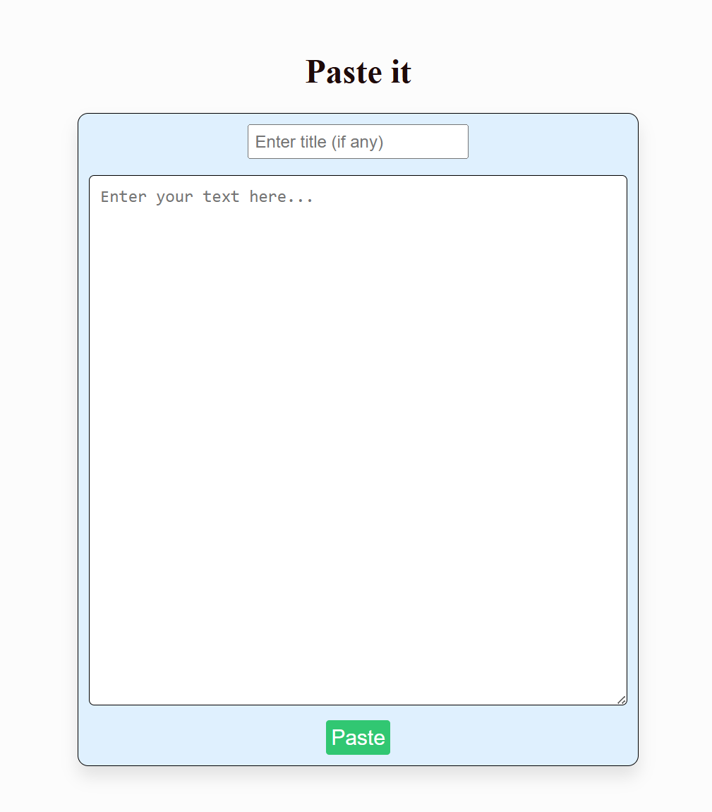

# 📝 PasteIt

A simple web app that allows users to paste and store text content securely in the cloud — accessible from **any device, anywhere** with an internet connection.

## 🌐 Features

- 🚀 Paste and save any text instantly
- 📱 Access your saved text from any device
- 🔒 Persistent storage in the cloud
- 🖥️ Clean, minimal interface

<p align="center">
  
</p>


## 📦 Tech Stack

- **Python / Flask** – Backend framework
- **HTML/CSS** – Frontend 
- **MySQL** – Data storage (depending on your setup)

## 🚀 Getting Started

### 1. Clone the Repository

```bash
git clone https://github.com/AMAYKJHA/paste-it.git
cd paste-it
